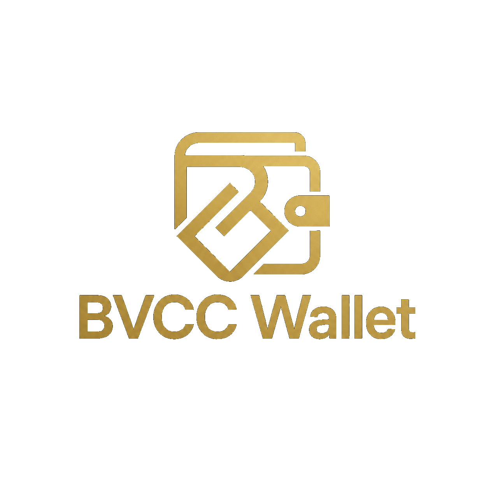
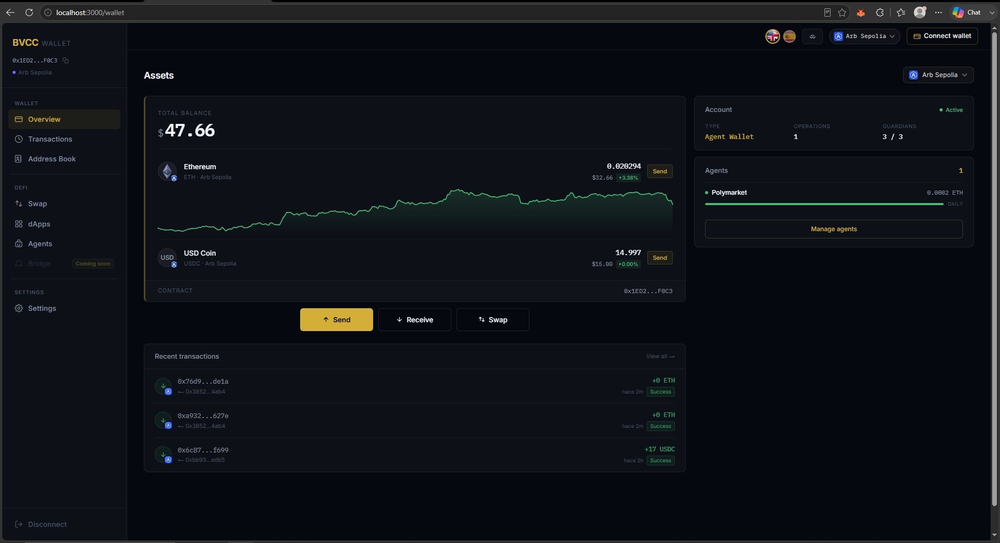
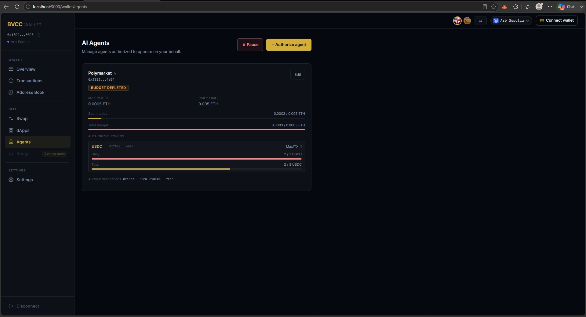
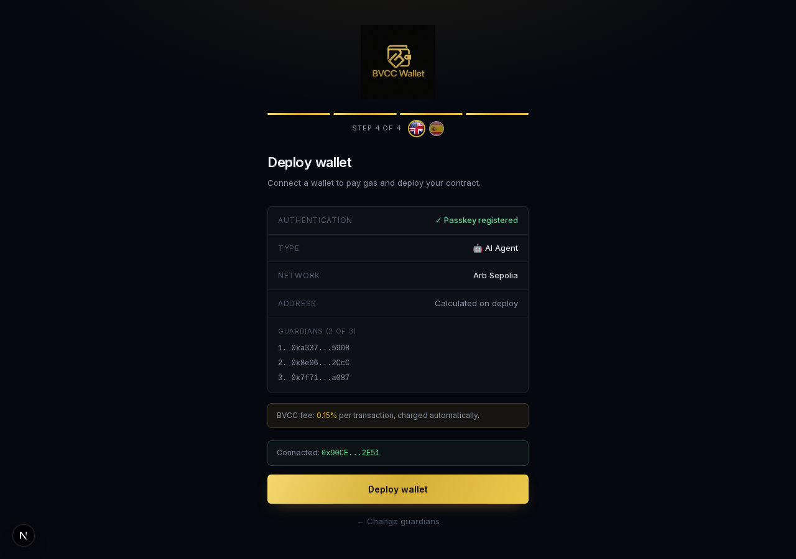
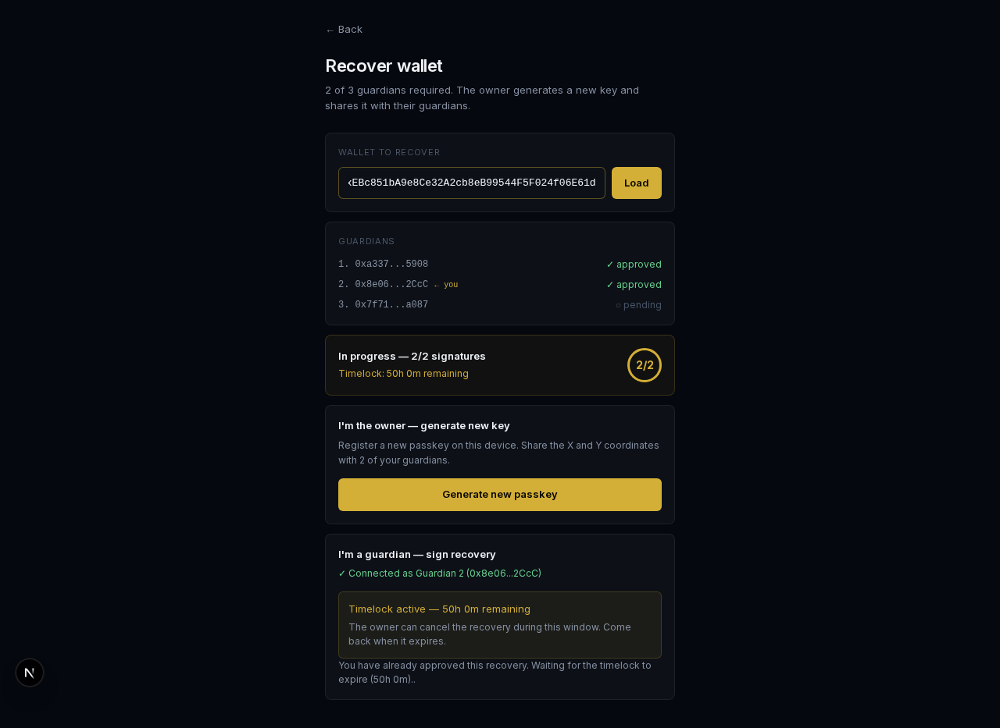

<p align="center">
  
</p>

<h1 align="center">BVCC Agent Wallet</h1>

<p align="center">
  Experimental open-source non-custodial smart wallet.<br>
  Face ID / WebAuthn · ERC-4337 · Self-custodial · No KYC
</p>

<p align="center">
  <b>URL:</b> bvccwallet.blockventurechaincapital.com
</p>

## Screenshots

### Dashboard — balances, assets & recent activity


### AI Agents — on-chain spending limits


| Create wallet (Face ID) | Guardian recovery (2-of-3) |
|:---:|:---:|
|  |  |

## Repository contents

This monorepo contains both halves of the project so judges can review them together:

- **Frontend** — Next.js app (this repo root: `app/`, `components/`, `lib/`, `public/`).
- **Contracts** — Foundry Solidity smart wallet + AI agent wallet contracts (`contracts/`):
  `BVCCWallet` / `BVCCWalletFactory` (personal) and `BVCCAgentWallet` / `BVCCAgentWalletFactory` (AI-agent, on-chain spending limits).
- **Tests** — 128/128 Foundry tests passing (`contracts/test/`). Run with `cd contracts && forge install && forge test` (`forge install` restores the libraries, which are git-ignored like `node_modules`).
- **Status** — Experimental public beta; smart contracts internally tested, **not externally audited**.

## License

Licensed under **GPL-3.0-or-later**. See [LICENSE](LICENSE).

## Important Notice

BVCC Wallet is experimental software provided as-is. BlockVenture Chain Capital is currently a Web3 brand/project. It is not a bank, broker, exchange, custodian, investment firm, or regulated financial institution. BVCC Wallet does not custody, control, manage, or recover user funds. Smart contracts may contain bugs or vulnerabilities. Use the software at your own risk and do not use funds you cannot afford to lose.

## Current Status

Public Beta / Experimental Mainnet Release — Internally tested smart contracts; Not externally audited yet; Use small amounts only; Agent Wallet permissions must be reviewed carefully by the user.

## Non-Custodial

BVCC Wallet does not store private keys, custody assets, or recover wallets. The user remains in control through WebAuthn/passkeys and configured guardians.

---

## Stack

- **Next.js 16.2.7** (App Router, Turbopack)
- **viem + wagmi v3** — on-chain reads, deploy via MetaMask/WC
- **WebAuthn API** — native biometric authentication (P256)
- **ERC-4337** — optional self-hosted bundler (`/api/send-userop`) with connected-wallet fallback, EntryPoint OZ v0.9
- **@walletconnect/web3wallet** — wallet mode (dApps connect to BVCC)

---

## Requirements

```bash
node >= 18
npm install --legacy-peer-deps
```

Copy `.env.example` to `.env.local` and fill in your own values:
```bash
cp .env.example .env.local
```
```
BUNDLER_PRIVATE_KEY=0x...          # OPTIONAL — EOA that calls handleOps (see "Bundler vs fallback")
ARBISCAN_API_KEY=...               # Etherscan API v2 (tx history)
COINGECKO_API_KEY=...              # USD prices (optional)
NEXT_PUBLIC_WC_PROJECT_ID=...      # Reown / WalletConnect project ID
```

> **Quick self-host:** you can leave `BUNDLER_PRIVATE_KEY` empty. The app
> automatically falls back to the connected wallet paying the gas. See below.

---

## Development

```bash
npm run dev        # http://localhost:3000
```

If you hit Turbopack cache errors:
```bash
rm -rf .next && npm run dev
```

---

## Architecture

### Contracts (`contracts/`)

| Contract | Network | Address |
|---|---|---|
| BVCCWalletFactory (patched) | Arb Sepolia | `0xa5290A51a73903176e09C864E1542a07da67BD12` |
| BVCCAgentWalletFactory (patched) | Arb Sepolia | `0xc87aa10747A92B472EF6B36e190B84c897a2953e` |
| EntryPoint OZ v0.9 | all | `0x433709009B8330FDa32311DF1C2AFA402eD8D009` |

### Wallet types

**BVCCWallet (type 0 — Personal)**
- Every transaction requires Face ID
- Fee: 0.05% sent automatically to the BVCC fee wallet

**BVCCAgentWallet (type 1 — AI Agent)**
- Extends BVCCWallet
- Lets you delegate operations to AI agents with granular permissions:
  - maxPerTxWei, dailyLimitWei, totalBudgetWei
  - Renewable period budget (e.g. 500 ETH / 7 days)
  - ERC-20 token and DeFi protocol whitelist
  - Expiry timestamp
- Fee: 0.15% per transaction
- The agent pays its own gas (direct EOA, not AA)

### Creation flow

1. **Step 1/4 — Network**: pick the deployment network
2. **Step 2/4 — Type**: Personal or AI Agent
3. **Step 3/4 — Guardians**: 3 recovery wallets (2-of-3 required)
4. **Step 4/4 — Deploy**: connect MetaMask, pay gas, receive a deterministic address

### Bundler vs fallback (who pays the gas)

Every operation is a **UserOp signed with WebAuthn (Face ID)**. The only thing
that changes between modes is **who submits it to `EntryPoint.handleOps` and pays
the gas**. The `lib/useSubmitUserOp.ts` hook resolves this automatically:

| Mode | When | Who pays the gas |
|---|---|---|
| **Server-side bundler** | `BUNDLER_PRIVATE_KEY` set (production / VPS) | the server's bundler EOA — Face-ID-only UX, no external wallet |
| **Connected-wallet fallback** | no `BUNDLER_PRIVATE_KEY` (local / self-host) | your connected wallet (MetaMask/WalletConnect), same as when creating the wallet |

Hook flow: it tries `POST /api/send-userop`; if the route responds
`501 { code: 'BUNDLER_NOT_CONFIGURED' }`, it calls `EntryPoint.handleOps([op], yourEOA)`
from the browser with the connected wallet (running `switchChain` if needed and
simulating before signing).

**It does not break non-custodial:** in both modes the UserOp is signed with
WebAuthn P256; whoever pays the gas only **relays** it — they cannot move funds
or change the signer. If there is neither a bundler nor a connected wallet, the
submission fails with a message asking you to connect a gas-funded wallet or set
`BUNDLER_PRIVATE_KEY`.

Bundler security: when running with a key, `/api/send-userop` only accepts
UserOps whose `sender` is a BVCC Wallet/Agent Wallet (`walletType()` ∈ {0,1} if
already deployed, or an `initCode` pointing to one of our factories) — anti
gas-drain. In fallback mode this does not apply because the user pays themselves.

### On-chain type detection

`useWalletType()` — calls `walletType()` on the contract via viem `readContract`.
It never uses localStorage as the source of truth for the type.
The sidebar shows "Agents" only when `walletType === 1`.

---

## Structure

```
app/
  page.tsx                  # Landing + creation flow (4 steps)
  wallet/
    layout.tsx              # Dynamic sidebar (Agents nav if walletType=1)
    page.tsx                # Dashboard (balance, assets, WalletConnect)
    send/                   # Send ETH/USDC
    swap/                   # Swap ETH↔USDC (Uniswap v3)
    transactions/           # History with filters
    address-book/           # Contacts
    agents/                 # AI agent management (agent wallets only)
    dapps/                  # dApps grid + iframe viewer
    settings/               # Network, guardians, session
    cancel-recovery/        # Cancel a recovery in progress
  recover/                  # Start recovery flow
  api/
    send-userop/            # Optional bundler (handleOps); falls back to connected wallet
    transactions/           # Etherscan API v2 proxy
    prices/                 # CoinGecko USD prices
    check-iframe/           # Detects whether a dApp allows embedding
lib/
  networks.ts               # 6-network config (Arb Sepolia active)
  NetworkContext.tsx        # Active-network React context
  abis.ts                   # ABIs: BVCCWallet, Factory, AgentWallet, AgentFactory
  useWalletType.ts          # Reads walletType() on-chain
  useWalletAddress.ts       # Reads address + credentialId from localStorage
  useSubmitUserOp.ts        # Submits UserOps: server bundler or connected-wallet fallback
  webauthn.ts               # registerWebAuthn / authenticateWebAuthn
  wallet.ts                 # getWalletAddress, getCredentialIdFromChain
  wcWallet.ts               # WalletConnect Web3Wallet singleton
```

---

## localStorage

| Key | Value |
|---|---|
| `bvcc_wallet_credential` | `{credentialId, walletAddress}` |
| `bvcc_active_wallet` | manually entered address |
| `bvcc_guardians` | `[addr1, addr2, addr3]` |
| `bvcc_address_book` | array of contacts |
| `bvcc_active_chain` | chainId of the selected network |

---


